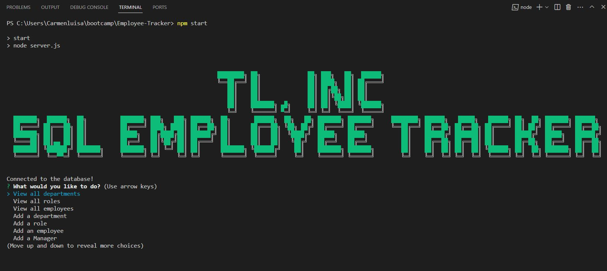

# Employee-Tracker

## Description
Employee-Tracker is a command-line application that manage a company's employee database, using Node.js, Inquirer, and MySQL. Providing the user with the opportunity to view all departments, view all employees, view all roles, amount other functions.
## Overview
```
User Story
AS A business owner
I WANT to be able to view and manage the departments, roles, and employees in my company
SO THAT I can organize and plan my business

Acceptance Criteria

GIVEN a command-line application that accepts user input
WHEN I start the application
THEN I am presented with the following options: view all departments, view all roles, view all employees, add a department, add a role, add an employee, and update an employee role
WHEN I choose to view all departments
THEN I am presented with a formatted table showing department names and department ids
WHEN I choose to view all roles
THEN I am presented with the job title, role id, the department that role belongs to, and the salary for that role
WHEN I choose to view all employees
THEN I am presented with a formatted table showing employee data, including employee ids, first names, last names, job titles, departments, salaries, and managers that the employees report to
WHEN I choose to add a department
THEN I am prompted to enter the name of the department and that department is added to the database
WHEN I choose to add a role
THEN I am prompted to enter the name, salary, and department for the role and that role is added to the database
WHEN I choose to add an employee
THEN I am prompted to enter the employee’s first name, last name, role, and manager, and that employee is added to the database
WHEN I choose to update an employee role
THEN I am prompted to select an employee to update and their new role and this information is updated in the database
WHEN I choose to update managers then  I am prompted to select a manager to update and their new role and this information is updated in the database
WHEN I choose to view all employees by manager THEN I am presented with a list of employees with their manager and department
WHEN I choose to view all employees by department THEN I am presented with a formatted table showing department name, employee name and lastme
WHEN I choose to delete department, roles and employees THEN I am presented with the options: employee, role and department
WHEN I choose to View the total utilized budget of a department—in other words, the combined salaries of all employees in that department then I am presented with a list of departments to choose from.
```


## Table of Contents 
- [Overview](#Overview)
- [Webpage-Preview](#Webpage-Preview)
- [Custom-Features](#Custom-Features)
- [Usage](#Usage)
- [Skill-Improved](#Skill-Improved)
- [Technologies](#Technologies)
- [Authors](#Authors)
- [Credits](#credits)


## Webpage Preview




## Usage
The link of the webpage is: https://drive.google.com/file/d/1R8WJ1_ijinmXla9v16PQpbpmOuhy4XRG/view

    
## Skills Improved
- Database design and creation.
- Database seeding
- Database inquiry
- npm application


## Technologies
 - [node.js](#node.js)
 - [Inquirer](#Inquirer)
 - [MySQL](#MySQL)
 - [npm](#NPM)
## License
  [](https://opensource.org/licenses/MIT)

## Authors
- [Carmen-Jimenez](#Carmen Jimenez https://github.com/clcoder2425/)

## Credits

- [W3School](W3School)
- [StackOverflow](https://stackoverflow.com)
- [Screencastify](https://app.screencastify.com/)

## Tutorials:
- [npmjs](https://www.npmjs.com/package/cfonts?activeTab=readme)
- [npm-mysql2](https://www.npmjs.com/package/mysql2)
- [Tutorials-Teacher](https://www.tutorialsteacher.com/sql/sum-function)


